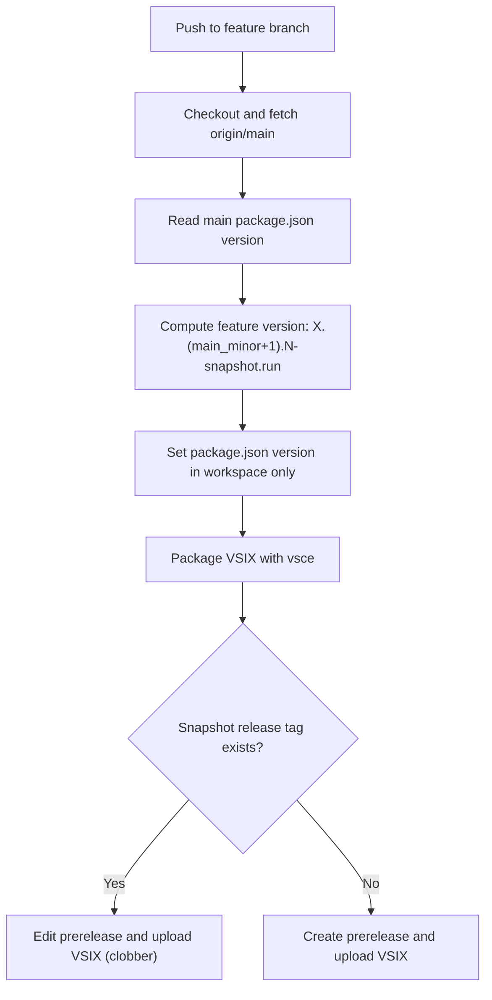
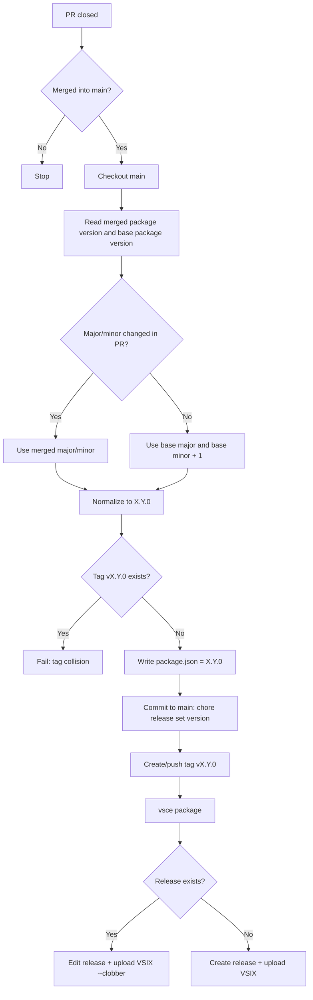
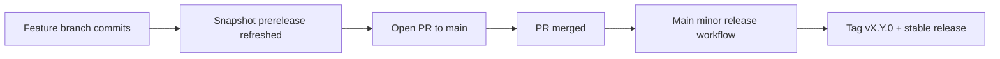

# Workflow Guide

This repository now uses two separate GitHub Actions workflows:

- `.github/workflows/feature-snapshot.yml`
- `.github/workflows/main-minor-release.yml`

## 1) Snapshot Builds (feature branches)

Trigger:
- Any `push` to non-`main` branches
- Manual run (`workflow_dispatch`)

Purpose:
- Rebuild VSIX on every feature-branch commit
- Publish/update one rolling prerelease per branch: `snapshot-<branch-slug>`

Version format used for feature artifacts:
- `X.(main_minor+1).N-snapshot.<run_number>`
- `X`: major from `origin/main` version
- `main_minor+1`: one minor higher than main
- `N`: commit index on feature branch since divergence from main (starts at 0)

## 2) Stable Releases (main via merged PR)

Trigger:
- `pull_request` event with type `closed`
- Job runs only if:
  - PR is merged
  - base branch is `main`
  - PR title does not start with `chore(release): set version to v` (loop guard)

Purpose:
- Create one stable minor release per merged PR
- Produce and publish stable semver tag `vX.Y.0`

Version decision:
- Compare merged PR version line vs base version line:
  - If PR changed major/minor: respect PR line
  - If not changed: auto-bump minor by +1 from base
- Final stable version is normalized to `X.Y.0`

## 3) End-to-end branch model

## 4) Practical notes

- Main stable releases are PR-merge driven, not direct-push driven.
- Snapshot builds do not persist version changes to git history.
- Main stable releases do persist version changes to `package.json` on `main`.
- Recommended repo setting: enable branch protection on `main` and disallow direct pushes.
